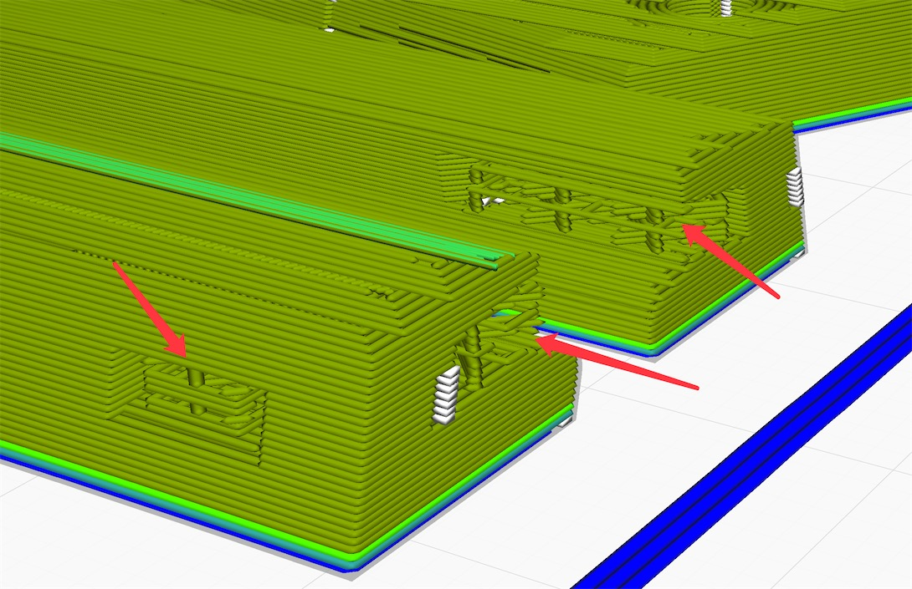

# Sony BVM D14H5 4:3 DI faceplate

| <!-- --> | <!-- --> |
| --- | --- |
|  |  |
|  |  |
|  |  |

I've provided arranged pieces called "AIO" so you can print the same colored pieces in one batch. It is the recommended way to print this project. However, just in case any piece came out imperfect from the batch, you can get the individual STL without the AIO prefix and re-print at ease.

The grey color on the BVM is very dark and I've found the "Cerprise" Grey to be very close. You might want to order a roll if you want to pursue an authentic color scheme.

------------

### Printing Hint

In order to avoid visible "lines" on the bottom layer, try these settings:
- Set 1st layer height to 0.16mm
- Add a -0.02mm offset
- Set flow of initial layer to 102%
- Try raising the first layer temperature by 5 degrees to help the plastic flow better into the texture of your bed.

--------

## AIO Printing Procedure

### Inner Horizontal Pieces

Print "[AIO][Black]Inner Horizontal Pieces.stl" **WITH** support.

#### Remove Support

After printing, remember to remove the support and clean up the holes.

--------

### Inner Side Pieces

Print "[AIO][Black]Inner Sides.stl" **WITHOUT** support. The maximum overhang is 50 degrees and should be easily handled by your printer.

--------

### Combiner Pieces

Print "[AIO][Black]Edeg Combiner Pieces.stl" as is.

--------

### Arrows Anchors

Print "[AIO][Grey]4 Arrows.stl" as is.

--------

### Top & Bottom Strips

Print "[AIO][Grey]Top Bottom Strips.stl" as is, **WITHOUT** support.

--------

### Tally Light Lens

Print "[AIO][White]Tally Light Lens.stl" as is, **WITH** support.

--------

## Advanced Text Printing (Optional)

The faceplate would look a bit barren if the markings are missing. You can pick the one(s) you'd like from the following and print them onto the TL/TR/BM pieces for better detailing.

### TL and TR Text Printing

- Clean the building plate.
- Switch to *WHITE* filament.
- Add "[Advanced][White]TL Text.stl" to the slicer.
- Add a **PAUSE** before the layer of the text.
- Ironing only the top layer is recommended for a better finish for the letters.

Start the print. Wait until the print pauses. Drop the piece TL into the printed cradle.

*If the TL piece is warped slightly, you can use the heated bed to heat up the piece and hold it flat for a minute to make it flat again.*

Once the piece is seated nicely and flat inside the cradle, resume the print to finish.

------

Repeat the same procedure for TR with "[Advanced][White]TR Text.stl"

------

BM Text Printing

Clean the building plate.

Switch to a **BLACK** filament.

Add "[Advanced][Black-Silver]BM Text.stl" to the slicer.

Add a pause before the layer of the base of the text
- Should be the 4th layer from the top if layer height is 0.2mm

Add a filament change at the layer of the smaller Sony text
- Should be the 2nd layer from the top if layer height is 0.2mm

Ironing only the top layer is recommended for a better finish for the silver letters.

Wait until the print pauses. Snap piece BM into the printed cradle.

*If the piece is warped slightly, you can use the heated bed to heat up the piece and hold it flat for half a minute to make it flat again.*

Once the piece is seated nicely and flat inside the cradle, resume the print.

When the printer stops again, switch to a **SILVER** filament and resume the print.

--------

## Assembly - Inner Frame

If your printer produces and elephant's foot, make sure to trim the edge where the two pieces meet. Otherwise when you join the two pieces together, it won't be flat.

Join the inner top and bottom pieces respectively with one combiner piece.

If there's some resistance, you could use a pair for pliers to help pushing the piece inside.

Do one side first, and then the other.

Make sure you don't apply too much force with the pliers, or you may slip and damage the plastic.

--------

Use 4 pairs for M2x8mm screw and nuts to join the top & bottom pieces to the side pieces.

Note the name of the pieces in the picture and don't confuse them, as the top and bottom are slightly asymmetrical. The picture is viewed from the front.

Don't over-tighten the screws or you'll damage the pieces.

- M3 screws & nuts - [Link](https://github.com/jeffqchen/JeffParts/blob/main/Parts/M2%20M3%20Hex%20Screw%20%26%20Nut/info.md)

---------

Snap the arrow anchors into the four corner pieces (TL/TR/BL/BR). If it's too tight, you might have to trim the edges of the pieces and holes slightly to make them fit.

You might want to use a table top to help you push the arrow anchors into the slots.

Make sure the arrow doesn't become crooked when you push, or it will become very difficult to push it in.

If the arrow gets stuck in a strangle position, push it back out from the pointy side with your fingers and try again.

----------

Put the top and bottom strip together.

If it's hard to push the ring into the peg, don't force it, or the peg will snap. Instead, trim around the outside edges of the ring and it should fit nicely.

The strips will feel loose and it's totally fine. You may use a piece of tape to temporarily hold them together from the outside,

Install the bottom strip first. Line up the peg and the arrow anchors accordingly and push both sides into the BVM.

Then, sit the inner frame on top of the bottom strip, line up the notches with the bottom piece and seat it in place.

Then, while holding the inner frame in place (you could use some tape to free up your hands), snap in the top strip into its place.

Adjust the horizontal middle sections of the inner frame if it looks crooked.

And you are all set!

