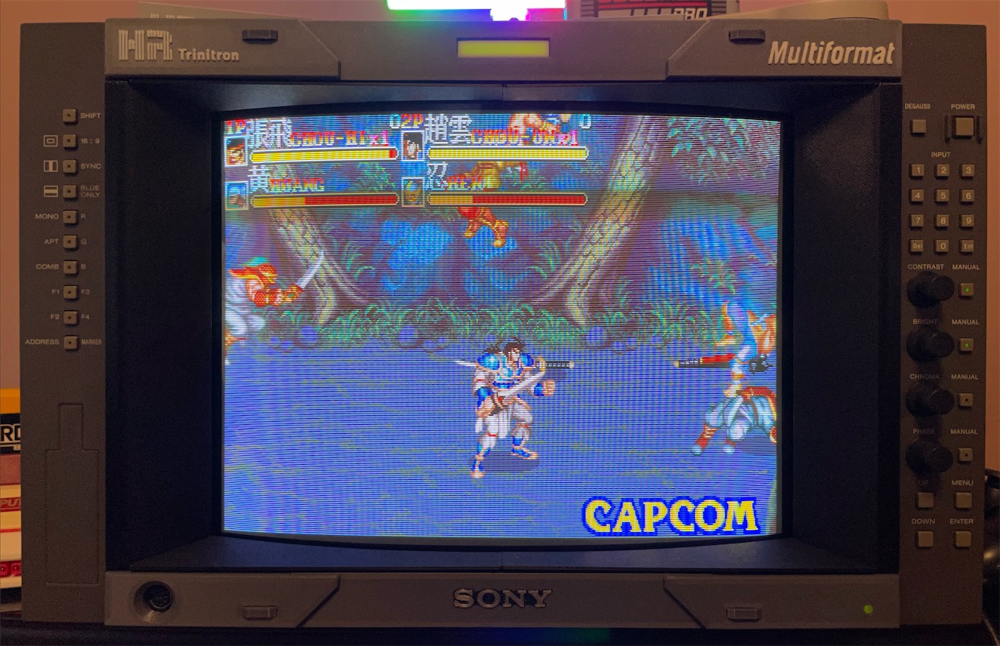

# BVM Faceplate

You bought a Sony BVM. It came with a 16:9 faceplate. Face palm. And there's almost no way to get a 4:3 faceplate nowadays. So, we print our own.

Currently finished model:

[BVM D14H5](./D14H5/4by3/README.md)
